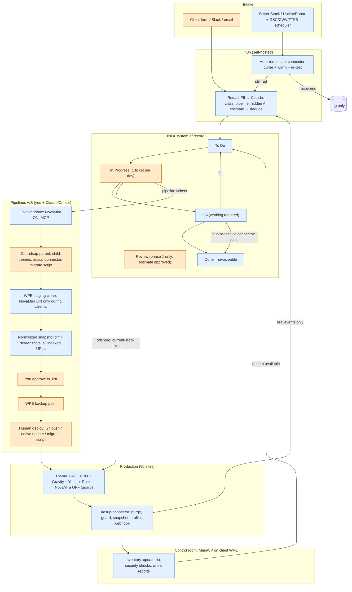

# CONTINUE_SESSION.md — AdsUp / 50-site WordPress portfolio

Handoff for a new Fable 5.1 thread. Attach only this file. Paste section 9 as the first message.

---

## 1. Role + current phase

Role: Master Architect for a ~51-site WordPress behavioral-health marketing portfolio (US addiction/BH, one billing, one law firm). Agency builds in Elementor today. Product = two pipelines (A: new sites/pages on classic PHP theme + ACF PRO + NovaMira/Claude; B: convert live Elementor/WPBakery sites onto that model) + AdsUp ops layer (control room on client WP Engine, event-driven tickets, human sign-off, staging diffs before prod updates, NovaMira off on production).

Phase: **architecture + SOPs + pilot plan + hours model delivered (v1). Next = pilot day 1 on bergencountymentalhealth.com.** All 7 challenges and 10 questions are answered.

Scan facts live in the first briefing; 50/51 WP 6.9+; modal Hello+Elementor+Yoast+Rocket+WPE.

---

## 2. Decisions locked (one line each)

- C1 = A: one Git parent theme `adsup-parent` + one child theme per brand; sites pin a tagged parent version.
- C2 = A: convert in place; theme via Git; content via idempotent WP-CLI script `wp adsup:migrate` run on prod at cutover; staging is rehearsal; no staging→prod DB copies.
- C3 = A: control room = MainWP self-hosted on a client-owned WPE install + bought monitoring + thin `adsup-connector`; HTML-diff step is our build.
- C4 = A: NovaMira on one gold dev sandbox + on a site's staging only during its conversion window; permanent AI surface = Git + REST/WP-CLI; never on production.
- C5 = A: Gravity Forms is the portfolio standard; `form_id` stored in ACF; one tracking hook in parent theme.
- C6 = A: normalized DOM snapshot diff + screenshot diff (homepage, contact, insurance) as the update/cutover gate.
- C7 = A: ACF PRO Flexible Content "Sections" on landing pages; blog posts in the block editor; ACF Blocks deferred until section vocabulary is stable.
- Q1 = E: Jira (Software; Standard tier when automation volume needs it). Time tracking on. Hidden `AI Estimate (h)` field. n8n for intake/redaction/Claude/QA re-test. Zoho archived.
- Q2 = E (phased): Phase 0 = no visible estimates/approvals for offshore; worklog required at QA; AI estimates hidden and compared on close; one ticket In Progress per dev. Safety gates (MCP writes, prod deploy, cutover, rollback) apply from day 1 but only touch you+Claude pipeline work. Phase 1 (after ~90 days / 20 tickets per class, AI within ±25%) = you sign estimates/code/cutover, client signs visual acceptance, offshore executes.
- Q3 = C: buy ACF PRO agency unlimited (~$249/yr); check WPE portal in case bundled.
- Q4 = D: design system vs unique decided per site after inventory; pilot proceeds as unique brand; hours model carries A/B/C variants.
- Q5 = B: conversion fidelity = visually equivalent; content char-for-char; colors/fonts/images/order preserved; px drift OK; you approve screenshot pairs; done-when stated in every SOP B ticket.
- Q6 = pilot site: **bergencountymentalhealth.com** (verify WPE + PHP + stack in portal on day 1).
- Q7: evergreen Elementor page today = GUESS 4h mid (2–6h band). Top-down anchor: offshore $28/h, client pays $30–35k/month ⇒ ~1,070–1,250 billed h/month across 220 August tasks (~5–5.7 h/task average).
- Q8 = A: buy+glue (Jira + n8n + Better Stack/UptimeRobot + MainWP + connector). Connector is read/purge/guard only; **humans deploy**. Routine plugin updates = staging rehearsal → diff → sign-off → WPE backup point → native update on prod → second diff. Conversions = Git + migrate script. Full staging→prod copy only for emergency restore.
- Q9: forms are **preserved, not redesigned** (settings, storage, notifications, CRM feeds, hidden fields, tracking). No PHI policy change by this project. **Constraint #1: forms and SEO never break; no change may create a bad SEO outcome.** Outranks speed, hours, fidelity.
- Q10: assume WPE + Cloudflare owner/admin (user believes so); day-1 access inventory confirms; 3 Elementor Cloud sites migrate to WPE and go last; SiteGround 4 after WPE 40.
- Ticket rules: ticket only on real events; auto-remediate before ticketing; "Likely cause" not "Cause"; bill approved estimate not elapsed time; worklog = actual for calibration; invoice = closed tickets only.

---

## 3. Decisions still open (with last recommended default)

- Who approves routine plugin diffs at 50-site scale (you vs offshore lead when diff is empty) → default: you until 3 clean monthly cycles, then offshore lead for "empty diff + matching screenshots" only.
- Whether client sees per-ticket estimates or monthly summary in phase 1 → default: monthly summary + ticket log link.
- What is billed during phase 0 → default: you write the price in Review for pilot-site tickets; fixed class table once taxonomy is stable; client's current arrangement continues elsewhere.
- n8n hosting → default: self-hosted on a small VPS (not WPE). Alternative: n8n cloud.
- Pipeline tooling ownership (parent theme, migrate script) is counted inside "first site" hours, not AdsUp build → confirm.
- Design families (Q4) → decided at inventory of sites 2–5.
- ACF PRO possibly bundled on WPE plan → check portal day 1.

---

## 4. Live architecture (v1)



Orange = human. Blue = automated. Automation observes, classifies, verifies, purges. It never deploys, never writes to production content, never enables NovaMira.

### Ticket taxonomy (from the August 220 rows)

Ticket template (every ticket): Title `BRAND / symptom → target`; one site; one URL if performance; Before / After; Likely cause; Do; Don't; Done when; Time box; hidden AI estimate; Original Estimate (phase 1).

| August class | ~count | Verdict | Pipeline | After AdsUp |
|---|---|---|---|---|
| New / evergreen / program pages | 68 | scoped build | A (converted site) / scoped UI ticket on unconverted | ACF page template ticket; copy+images+parent URL+Yoast in ticket |
| "SEO technical optimizations (# of hours)" | 47 | **die** | ops | Replaced by event tickets only: GSC coverage drop, 404 spike, CWV Good→Poor, TTFB regression |
| "SEO blogs (# of blogs)" | 16 | scoped build | ops/content | Block-editor post ticket; never Elementor |
| Elementor layout tweaks | 14+ | scoped build → dies after conversion | ops now; A after | Time box 1h on unconverted; theme PR via Git on converted |
| Cache / Rocket / CTM / self-referral | 12 | **die** (auto) + one rules ticket | ops | Connector 3-layer purge; one-time Rocket exclude for CTM/tracking per site |
| HTTP mixed content | 8 | scoped build, one-time | ops | One crawl ticket per site, then monitor |
| Draft + 301 | 7 | scoped build, batch | ops | List-driven Redirection import |
| GSC / GTM setup | 4 | scoped build, once | ops | Once per property |
| Staff bios | 4 | scoped build | B then A | CPT + ACF after conversion; content ticket |
| Canonical / internal links | 4 | scoped build, batch | ops/A | List-driven |
| Incidents (site won't load) | 3 | **incident** | ops | Uptime → auto-remediate → ticket only if still red |
| Tech-report lines (robots, sitemap, IndexNow, daily uptime, GTmetrix, minify) | recurring | **die** | ops automation | Never billed as labor |

---

## 5. SOPs

### SOP A — new site or new page (classic theme + ACF PRO + NovaMira/Claude)

Preconditions: gold sandbox WP 6.9+, PHP 8.2 (portal-verified), Git access to `adsup-parent` and the brand child repo, ACF PRO active, `acf-json/` in the child theme, NovaMira on sandbox only with MCP connected, Jira ticket exists.

**A-new page on a converted site (most common, 68/month class)**

1. Ticket must contain: page title, slug, parent URL, copy per section, images (uploaded to media library or attached), Yoast title + meta description, form ID if any, internal links. Missing → back to To Do with comment.
2. Confirm site profile: `GET /wp-json/adsup/v1/profile` shows `converted: true`, parent tag, template `page-sections.php` present.
3. Prompt (Cursor/Claude with NovaMira MCP on **staging**, never production):

```
Ticket ADSUP-###. Site: {brand} staging. Create a DRAFT page.
Title: "{title}". Slug: "{slug}". Parent: "{parent-slug}". Template: page-sections.php.
ACF Flexible Content field "sections" with layouts in this order:
  hero {headline, subhead, cta_label, cta_url, image_id}
  {layout_2} {...}
  faq {items[] {question, answer}}
  cta_band {headline, form_id={form_id}}
Fill every field verbatim from the copy below. Do not rewrite copy. Do not create fields or layouts that do not already exist in acf-json; if a section does not map, stop and list it.
Yoast: title "{yoast_title}", meta description "{yoast_desc}", canonical = self, robots index/follow.
Do not touch any other post, menu, option, plugin, or theme file. Output the list of writes before executing; wait for my "yes".
```

4. QA prompt (same session):

```
Fetch {staging_url} logged-out. Report: exactly one H1; <title> and meta description match the ticket; canonical is self; JSON-LD parses; zero "elementor-" classes; gtag/GTM present exactly once; form {form_id} renders with the expected field names; all images have alt; all internal links resolve 200 on staging. List failures only.
```

5. Screenshot desktop + mobile on staging; attach to ticket.
6. Publish on production via WP-CLI over WPE SSH or REST (not NovaMira): create page with identical ACF values (`wp post create` + `wp post meta` or `acf/update_field` via a one-off script). Connector auto-purges on save; confirm all three layers returned OK.
7. Run the QA prompt against the production URL. Move to QA; n8n re-test passes → Done.

**A-new site (HTML/CSS/JS export on disk)**

1. Create repo `{brand}-child` from the child template. Copy the export into `/export`.
2. Prompt:

```
Convert /export into a WordPress child theme of adsup-parent named "{brand}".
Rules: classic PHP templates only (no Elementor/Bricks/Divi/FSE). Keep every original CSS class name. Enqueue the existing CSS/JS via wp_enqueue_* with file-based versioning. header.php/footer.php use wp_head/wp_footer/body_class. front-page.php and page-sections.php render ACF Flexible Content "sections". Each HTML section becomes one layout with fields named for a non-technical editor (headline, subhead, cta_label...). Repeating cards → repeater; staff/locations/insurance → CPTs only if they repeat across pages. Header/footer content → ACF Options page. Escape all output (esc_html, esc_url, esc_attr, wp_kses_post). Save field groups to acf-json/. Do not add a gtag if the parent already outputs one. Output the file tree, then write files. Do not connect to any production site.
```

3. Load on sandbox; run the QA prompt on every template; fix; commit; tag `v0.1.0`.
4. Deploy to WPE staging via Git push; connect NovaMira on staging for content entry only if needed; enter content or run `wp adsup:seed` from the export.
5. Role: confirm `content_editor` (pages/CPTs/media only; no themes, plugins, settings, NovaMira, ACF UI) exists from parent; create client users with it.
6. Production cutover = Git deploy + WP-CLI activation; NovaMira not installed on prod; connector guard active; Yoast sitemap submitted once in GSC; one analytics path only.

### SOP B — Elementor (or WPBakery) → parent/child theme + ACF conversion

Constraint #1 applies to every phase: forms and SEO never break. Any gate failure = stop, not "fix later".

**Phase 0 — Prereqs (0.5 day)**
- WPE portal: PHP version (7.4 → upgrade to 8.2 on staging first and test; block conversion until prod is 8.2+), backup point, create/refresh staging clone.
- Jira epic `{BRAND} conversion` with child tickets per phase. Done-when for the epic: "visually equivalent (Q5=B); all indexed URLs unchanged in title/canonical/robots/JSON-LD/H1; all forms fire identical feeds; GSC stable 14 days."

**Phase 1 — Inventory on staging (NovaMira ON for this window only)**
- Prompt:

```
Using NovaMira on {brand} STAGING (read-only tasks): list active plugins with versions; theme; all pages/posts/CPTs with slug, template, Elementor-built yes/no; Elementor Theme Builder templates (header, footer, single, archive, popups); global widgets; every form (plugin, ID, fields with names/required/hidden, notifications, feeds/webhooks, confirmation); Yoast settings export; Rocket excludes and delay-JS lists; every tracking snippet (GTM, GA, CTM/CallRail, Meta) and where it is injected; Redirection rule count; sitemap URL count. Output as inventory.md. Do not modify anything.
```
- Export the Yoast settings and Redirection rules. Crawl the sitemap on prod with Screaming Frog (or n8n) and store: URL, status, title, meta description, canonical, robots, H1, JSON-LD types → `seo-baseline.csv`. Screenshot money pages desktop/mobile.
- Take connector normalized snapshots of **every indexed URL** on prod → `snap-prod-before/`.

**Phase 2 — Freeze**
- Announce: no new Elementor pages or layout edits on prod during conversion except emergencies (ticketed). Content edits to text are allowed; the migrate script re-reads prod at cutover, so they survive.

**Phase 3 — Extract sections → ACF**
- Prompt:

```
From inventory.md and the staging pages, define ACF field groups for adsup-parent Flexible Content "sections": one layout per unique section type found across homepage, program pages, insurance, contact, locations. Field names an editor understands. Repeating cards → repeater. Staff/locations/insurance → CPT only if used on more than one page. Header/footer → Options page fields. Reuse existing layouts from adsup-parent acf-json where the shape matches; add new layouts only when needed and list them. Output acf-json files + a mapping table: Elementor widget/template → layout/field.
```
- Commit to the child theme repo (`acf-json/` lives in the child for brand-specific layouts; shared ones go to parent via PR).

**Phase 4 — Theme port**
- Prompt:

```
Build the {brand} child theme of adsup-parent. Port the computed look of the Elementor pages by copying the effective CSS for each section into the child stylesheet with the original class names; do not depend on elementor-frontend.css or any elementor-* wrapper. Rebuild header/footer/mobile nav in header.php/footer.php from the Theme Builder templates. Templates: front-page.php, page-sections.php, single.php, archive.php, plus CPT templates from Phase 3. Escape all output. Enqueue only the child CSS/JS and the fonts already used. Do not add gtag; tracking stays in its current injection point (GTM). Keep Yoast and Redirection untouched.
```
- Activate on staging with Elementor still installed; nothing breaks because Elementor pages still render through their own templates until content is migrated.

**Phase 5 — Content migration script**
- Write `wp adsup:migrate --site={brand} [--post=ID] [--dry-run]` in the child theme (or a small mu-plugin): reads `_elementor_data` per post, walks the mapping table, writes ACF `sections` postmeta by post ID; sets template to `page-sections.php`; idempotent (re-run overwrites cleanly); prints a per-post report of widgets it could not map.
- Run on staging; agent handles unmapped leftovers by ticket; re-run until report is empty for money pages; verify text char-for-char (diff extracted visible text vs snapshot).

**Phase 6 — Forms (parity, no redesign)**
- For each form: if already Gravity → keep ID, keep settings. If Elementor form / other → rebuild in Gravity replicating fields, names, hidden fields, required flags, confirmation, notifications, every feed/webhook, spam settings. Test submission on staging to a **test** endpoint; compare payload keys to inventory. Attach GTM/CTM events via the parent theme hook, verified in GTM preview.
- Rocket: exclude CTM/CallRail/GTM scripts from delay-JS and minify (known August failure).

**Phase 7 — SEO freeze verification (gate)**
- Same slugs; permalinks Post name; Yoast settings unchanged; sitemap URL identical; robots.txt untouched.
- Connector snapshots on staging for every indexed URL → diff vs `snap-prod-before/`. Gate: zero differences in `<title>`, meta description, canonical, robots, hreflang, H1, JSON-LD, internal link targets. Visible-text differences must be zero except ticketed ones.
- Screenshot pairs (desktop/mobile) for money pages → you approve (Q5=B).
- CWV spot-check one URL mobile.

**Phase 8 — Cutover (freeze window: hours)**
1. WPE backup point on prod. Confirm rollback path (theme switch + Elementor re-activate + republish) rehearsed on staging.
2. Git deploy child theme + parent tag to prod (files only). Activate child theme via WP-CLI.
3. Run `wp adsup:migrate --dry-run` on prod; review report; run for real.
4. Set Elementor-built pages' template to `page-sections.php` (script does this). Do **not** delete Elementor data. Deactivate nothing yet.
5. Connector purge all layers. Snapshot every indexed URL → diff vs `snap-prod-before/`. Gate identical to Phase 7. Any failure → rollback immediately.
6. Live form test submissions (one per form, marked test) → confirm feeds received. Failure → rollback.
7. Move epic to QA; n8n re-test; Done only after step 8 clock finishes.

**Phase 9 — Watch (14 days)**
- GSC coverage, impressions, 404/soft-404 daily; Better Stack on money URLs; form submission counts per form vs baseline. Any trigger (form feed failure; indexed URL non-200; title/canonical/schema diff not ticketed; coverage drop) → rollback decision same day.
- NovaMira removed from staging at start of this phase.

**Phase 10 — Uninstall Elementor**
- Day 14 clean: deactivate Elementor Pro, then Elementor; re-run snapshot diff (CSS regressions appear here). Day 30 clean: delete both plugins and Hello theme if the child is standalone; Rocket excludes cleaned; ticket closed.

**Rollback (any phase after 8)**: switch theme back to Hello; re-activate Elementor + Pro; templates back to default (`wp adsup:migrate --revert` restores `_wp_page_template`); purge; snapshot diff vs `snap-prod-before/`; restore WPE backup only if the diff is not clean. ACF postmeta may stay; it is inert.

**WPBakery outliers**: same phases; inventory reads `post_content` shortcodes instead of `_elementor_data`; Rank Math stays Rank Math.

---

## 6. Pilot — first 14 days on bergencountymentalhealth.com

Day 1 — Access + facts: WPE portal login; PHP version (8.2/8.4 go; 7.4 = upgrade staging first); confirm Hello + Elementor Pro + Yoast + Rocket + Redirection; page count; form plugin and feeds; Cloudflare zone ownership + API token; Git org; buy ACF PRO (check WPE bundle first) + Gravity Elite; create Jira project `ADSUP`, time tracking on, hidden `AI Estimate (h)` field, workflow To Do → In Progress → QA → Done with worklog-required rule.
Day 2 — Gold sandbox (local or WPE dev env): WP 6.9+, PHP 8.2, ACF PRO, NovaMira, MCP OAuth to Cursor/Claude; prove "list installed plugins". Repos: `adsup-parent`, `bergen-child`, `adsup-connector`.
Day 3 — `adsup-parent` v0.1: `functions.php`, `content_editor` role, `page-sections.php`, section partials for hero/faq/cta_band, `acf-json/` skeleton, escaping helpers, NovaMira-off + ACF-admin-hide guards. Tag.
Day 4 — `adsup-connector` v0.1: purge (Rocket + WPE + Cloudflare), guard, profile, webhook, app-password auth. Install on sandbox; prove purge returns 3× OK.
Day 5 — WPE staging clone of pilot; backup point; NovaMira on staging; **SOP B Phase 1 inventory**; `seo-baseline.csv`; screenshots; prod snapshots of all indexed URLs. Announce freeze.
Day 6 — n8n on VPS: intake form → redact → Claude classify + hidden estimate → Jira; Better Stack monitors on homepage/contact/insurance with Cloudflare allow-list; auto-remediate flow (purge + warm + re-test).
Day 7 — SOP B Phase 3: ACF layouts for homepage + one interior template (program page); mapping table; commit.
Day 8 — SOP B Phase 4: child theme port of header/footer/nav + homepage + program template CSS; activate on staging.
Day 9 — SOP B Phase 5: `wp adsup:migrate` v0.1; run on homepage + program pages; fix unmapped widgets; text diff clean.
Day 10 — SOP B Phase 6: forms parity on staging (test endpoint); Rocket excludes for CTM/GTM; GTM preview.
Day 11 — SOP B Phase 7: snapshot diff staging vs prod-before for all indexed URLs (only homepage + program pages should differ, and only in markup, not SEO fields); screenshot pairs → you approve; CWV spot-check.
Day 12 — Rehearse cutover + rollback on staging twice. Offshore onboarding: 5 real tickets (2 blogs, 1 301 batch, 1 mixed-content crawl, 1 evergreen page on the *unconverted* stack) flow through Jira with worklogs; hidden estimates recorded.
Day 13 — Cutover on prod for homepage + program template only (SOP B Phase 8). Elementor stays installed. Snapshot diff gate; live form tests; purge.
Day 14 — Watch begins (Phase 9). Retro: actual hours per phase → replace GUESS numbers in Table 2 "first site"; decide design-family question for sites 2–5; write the client's first monthly ticket log.

Not in the 14 days: other pages on the pilot, any second site, Elementor uninstall (day 28/44), MainWP rollout beyond pilot + sandbox.

---

## 7. Hours model (every number is a GUESS unless marked FACT)

Anchor (FACT-ish from client): offshore $28/h; client pays $30,000–35,000/month ⇒ 1,071 (LOW) / 1,160 (MID) / 1,250 (HIGH) billed h/month. August task counts are FACT.

### Table 1 — Current client/offshore labor per month (work to take over)

Hours = count × guessed real h/ticket. Padded = anchor − real.

| Class | Count (FACT) | LOW h/t → total | MID h/t → total | HIGH h/t → total |
|---|---|---|---|---|
| Evergreen/program pages | 68 | 2 → 136 | 4 → 272 | 6 → 408 |
| Blogs | 16 | 1 → 16 | 1.5 → 24 | 2.5 → 40 |
| Elementor tweaks | 14 | 0.5 → 7 | 1 → 14 | 2 → 28 |
| Cache/Rocket/CTM | 12 | 0.5 → 6 | 1 → 12 | 2 → 24 |
| Mixed content | 8 | 1 → 8 | 2 → 16 | 3 → 24 |
| Draft + 301 | 7 | 0.5 → 3.5 | 1 → 7 | 2 → 14 |
| GSC/GTM | 4 | 1 → 4 | 2 → 8 | 3 → 12 |
| Staff bios | 4 | 0.5 → 2 | 1 → 4 | 1.5 → 6 |
| Canonical/internal | 4 | 0.5 → 2 | 1 → 4 | 2 → 8 |
| Incidents | 3 | 1 → 3 | 2 → 6 | 4 → 12 |
| Other/unclassified rows | 33 | 0.5 → 16.5 | 1 → 33 | 2 → 66 |
| **REAL labor subtotal** | 173 | **204** | **400** | **642** |
| PADDED: calendar/tech-report lines (uptime, GTmetrix, robots, sitemap, IndexNow, minify) | 51 sites | 2/site → 102 | 3/site → 153 | 4/site → 204 |
| PADDED: "SEO technical optimizations (# of hours)" (derived remainder) | 47 | 16.3/t → 765 | 12.9/t → 607 | 8.6/t → 404 |
| **PADDED subtotal** | | **867** | **760** | **608** |
| **Portfolio total (= anchor)** | 220 | **1,071** | **1,160** | **1,250** |
| Real share of invoice | | 19% | 34% | 51% |

### Table 2 — Future CLIENT work after AdsUp exists (not AdsUp build time)

Monthly residual, same August classes, monitoring/tickets/pipelines live, sites converted:

| Class | Assumed count | LOW | MID | HIGH |
|---|---|---|---|---|
| New page on converted theme (SOP A) | 68 | 0.75 → 51 | 1.5 → 102 | 3 → 204 |
| Blog post (block editor) | 16 | 0.75 → 12 | 1 → 16 | 1.5 → 24 |
| Theme tweak via Git PR (replaces Elementor tweaks) | 3 | 0.5 → 1.5 | 1 → 3 | 2 → 6 |
| Cache rules residual (purge is automatic) | 1 | 0.5 | 1 | 2 |
| Mixed content residual (monitored) | 1 | 0.5 | 1 | 2 |
| 301 batches | 2 | 0.5 → 1 | 1 → 2 | 1.5 → 3 |
| GSC/GTM residual | 1 | 0 | 1 | 2 |
| Staff bios (CPT entry) | 4 | 0.25 → 1 | 0.5 → 2 | 1 → 4 |
| Canonical/internal batch | 1 | 0.5 | 1 | 2 |
| Incidents (after auto-remediate) | 3 | 0.5 → 1.5 | 1 → 3 | 2 → 6 |
| Event tickets replacing SEO-hours bucket (GSC/404/CWV/TTFB) | 5/10/15 | 0.5 → 2.5 | 1 → 10 | 1.5 → 22.5 |
| Plugin update sign-off cycle (50 sites, monthly) | 50 | 0.1 → 5 | 0.2 → 10 | 0.4 → 20 |
| Calendar lines (uptime, CWV, robots, sitemap, IndexNow) | — | 0 | 0 | 0 |
| **Monthly residual total** | | **≈77** | **≈152** | **≈298** |
| vs Table 1 anchor | | −93% | −87% | −76% |
| vs Table 1 REAL labor | | −62% | −62% | −54% |

SOP A per new page on converted theme: LOW 0.75 / MID 1.5 / HIGH 3 h (today GUESS 4h).

SOP B one-time conversion hours per site (includes SEO/form verification, which does not shrink: LOW 6 / MID 10 / HIGH 16 per site in every variant):

| Variant (Q4) | LOW | MID | HIGH |
|---|---|---|---|
| A unique brand — first site (pilot, incl. parent theme + migrate script v0.1) | 60 | 100 | 160 |
| A unique brand — site 10 | 30 | 50 | 80 |
| B design family — first site of a family | 30 | 50 | 80 |
| B design family — additional member | 15 | 25 | 40 |
| C design-system rebrand — system build (one-time) | 40 | 80 | 150 |
| C design-system rebrand — per site | 12 | 20 | 35 |
| Portfolio one-time, all-A (1 + 9 ramp + 40 steady) | ≈1,665 | ≈2,775 | ≈4,440 |
| Portfolio one-time, mixed (10 A ramp + 26 family members + 14 unique) | ≈1,240 | ≈2,125 | ≈3,440 |

### Table 3 — MY time to implement AdsUp (labor for me + AI)

| Row | BUY | BUILD LOW | BUILD MID | BUILD HIGH |
|---|---|---|---|---|
| WPE install + MainWP shell + roles + bot users | MainWP core free; ext ≈$300/yr | 8 | 14 | 24 |
| Uptime + alerts (call/SMS/Slack) + Cloudflare allow-list + auto-remediate flow | Better Stack ≈$30–100/mo | 6 | 10 | 18 |
| SSL/domain expiry | Better Stack (SSL); n8n RDAP check | 2 | 4 | 8 |
| CVE / security-baseline gaps | MainWP security ext + Wordfence/WPScan API | 6 | 12 | 20 |
| Malware + blacklist | Wordfence + Safe Browsing/VirusTotal via n8n | 3 | 6 | 12 |
| 3-layer cache purge (connector) | — | 6 | 10 | 16 |
| Connector core (guard, profile, webhook, auth) | — | 6 | 10 | 16 |
| Plugin updates: staging → normalized diff → screenshots → sign-off → native prod update → verify | Playwright/screenshot API | 20 | 35 | 60 |
| Ticketing: Jira setup, n8n intake/redaction/Claude, hidden estimate, shadow compare, QA re-test, invoice=closed | Jira Standard ≈$8/user/mo; n8n VPS ≈$10/mo | 16 | 28 | 48 |
| Broken-link / redirect list → Redirection CSV | Screaming Frog / MainWP ext | 4 | 8 | 14 |
| Rollout per site (MainWP child + connector + allow-list + app password) × 50 | — | 15 | 25 | 50 |
| Runbooks for offshore | — | 4 | 8 | 12 |
| **MVP total (≈5 sites: uptime + tickets + purge + baseline list)** | ≈$150–250/mo | **≈50** | **≈85** | **≈140** |
| **Full sold spec (50 sites + HTML-diff plugin manager)** | ≈$200–350/mo | **≈95** | **≈170** | **≈300** |

Calendar (one person + Claude/Cursor, ≈20 build h/week alongside pilot work): MVP ≈2.5 / 4 / 7 weeks; full ≈5 / 8.5 / 15 weeks. Normalizer tuning needs ≈1 month of real diffs regardless of hours. Hours ≠ weeks. Pipeline tooling (parent theme, migrate script) is in Table 2 "first site", not here. 50-site conversions are not here.

### What to quote (derived from Tables 1–2)

- **This month, zero risk:** remove the calendar/tech-report lines from the invoice — automation, never labor. Table 1 MID: 153 h ≈ **13% of billed hours** (LOW 10%, HIGH 16%).
- **This month, transparent not cheaper:** scoped-build classes (pages, blogs, 301s, bios, links) at fixed prices from Table 1 MID rates; same ≈400 h, but every hour has a ticket, a URL, and a worklog.
- **Needs 90 days of closed tickets:** the 47 "SEO hours" tickets ≈ 607 h MID ≈ **52% of billed hours**. Event tickets are guessed at ≈10 h/month, but that is a guess until the event log exists. Do not quote the cut; quote "event tickets only, priced per ticket".
- **Needs conversion first:** page hours 4 → 1.5 MID (−62% per page) only on converted sites; pilot proves the number on one site before it is quoted anywhere else.
- **Steady state, not quotable yet:** 1,160 → ≈152 h/month MID (−87%) assumes all conversions done and 90 days of calibration. Publish it as a target, not a promise.
- **Start taking Table 1 work when MVP is done enough:** connector purge + guard on pilot + 4 sites, Better Stack alerting with allow-lists, Jira + n8n intake with hidden estimates and worklogs, baseline security list produced — ≈85 h MID / ≈4 weeks. First classes to take: blogs, 301 batches, cache tickets, evergreen pages on the pilot.

---

## 8. Risks and non-goals

Risks:
- Pilot PHP is 7.4 → upgrade on staging first; conversion blocked until prod is 8.2+.
- Cloudflare 403 blocks monitors/connector fetches → WAF allow-list per zone is a day-1 dependency; if Cloudflare is WPE Global Edge Security, purge/allow-list go through WPE.
- Elementor widgets the migrate script cannot parse (custom addons, dynamic tags) → per-site agent leftovers; bounded by the report.
- Form feed silently broken after Gravity rebuild → test endpoint + live test + submission-count monitor; rollback trigger.
- SEO regression from CSS/markup change (H1 count, schema) → all-indexed-URL snapshot gate; 14-day GSC watch; Elementor kept installed until day 14/30.
- Normalizer false positives make the diff gate noisy → month of tuning; filterable rules; keep screenshots as second signal.
- Parent theme bug reaches many sites → tagged versions, sites pin, staging diff before bump.
- Offshore gaming worklogs → one ticket In Progress per dev; elapsed vs worklog sanity check; per-dev class comparison.
- Client/offshore create tickets in the old "SEO hours" shape → n8n reclassifies; Review queue.
- Jira Free automation caps → Standard tier.
- Elementor Cloud (3) and SiteGround (4) hosts differ → scheduled last; Elementor Cloud migrates to WPE first.
- Yonder BH unreachable → excluded until it loads.
- Rank Math outliers (WPBakery sites) → never swap SEO plugin.

Non-goals:
- No second page builder as layout engine. No FSE as landing-page builder.
- No billing of uptime, CWV, robots.txt, sitemap, IndexNow as labor.
- No PHI policy change; forms preserved as-is.
- No staging→prod DB copies except emergency restore.
- No NovaMira on production, ever. No unreviewed MCP writes.
- No 50-site rollout before pilot day 14 retro.
- No redesigns unless a client asks (Q5=B).
- No custom dashboard UI, ticketing app, or monitoring stack (buy+glue).

---

## 9. Next action for the new chat (paste as first user message)

> You are the Master Architect for the 50-site behavioral-health WordPress portfolio described in the attached CONTINUE_SESSION.md. All decisions in section 2 are locked; do not reopen them unless you find a hard conflict, and if so say why and wait. Phase: pilot day 1 on bergencountymentalhealth.com. Give me, in order and nothing else: (1) the day-1 checklist as a Jira-ready ticket list (title, done-when, time box) covering WPE portal facts, access inventory, license purchases, Jira project setup, repo creation; (2) the `adsup-parent` v0.1 file tree with the `functions.php`, `content_editor` role, NovaMira-off guard, ACF-admin-hide guard, and `page-sections.php` loop as copy-pasteable code; (3) the `adsup-connector` v0.1 file tree and the purge endpoint code (Rocket + WPE + Cloudflare) with app-password auth. Label every hour GUESS. Then wait for my day-1 findings before touching SOP B.

---

## 10. Scan facts

Scan facts live in the first briefing; 50/51 WP 6.9+; modal Hello+Elementor+Yoast+Rocket+WPE.
